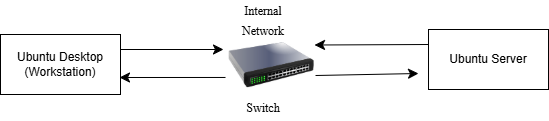
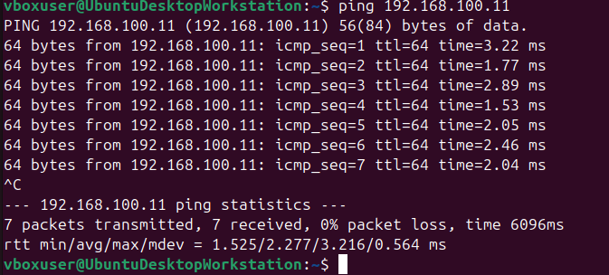
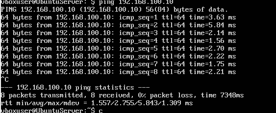
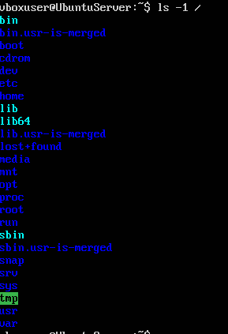
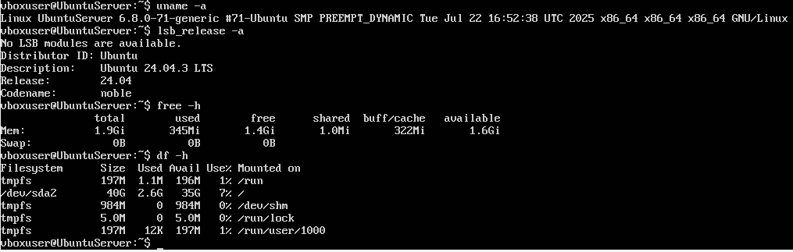

# Week 1 – System Architecture and Distribution Selection

## Virtual Machine Setup:

I used 2 linux virtual machines using VirtualBox. One of them is an Ubuntu Server and the other is an Ubuntu Desktop. The server virtual machine is a headless system without a graphical interface and is used to host services, run performance tests and act as a target for security evaluation. The workstation virtual machine is used for remote administration over SSH and monitoring. Separating the roles of a server and a workstation replicates a realistic real life scenario where servers are managed over the network from a workstation. Both virtual machines are connected using internal network. This network allows communication between the virtual machines and it prevents direct connection from external hosts this allows a controlled environment without any risks to any other systems. On each virtual machine I used ip addr to verify IP addresses and confirmed connectivity by pinging both virtual machines. The final static Ips I used was for Ubuntu Desktop(Workstation) 192.168.100.10 and for the Server I used 192.168.100.11.

**Figure 1.1 – VirtualBox Internal Network Configuration**  

**Figure 1.2 – Server IP Address Configuration**  

**Figure 1.3 – Workstation IP Address Configuration**  

---

## Server and Workstation Selection And Justification:

In this week I focused on planning the system architecture and choosing which linux distribution to choose for the server. I considered several linux distributions which include Ubuntu Server, Debian and AlmaLinux. The main evaluation criteria I used was long term support, package management system, compatibility with the lab materials and availability of security and monitoring tools. I showed this via a table below.

| Distribution | Advantages | Disadvantages | Decision |
|-------------|------------|---------------|----------|
| Ubuntu Server | Long-term support, apt system | Slightly larger base | Selected as the primary server |
| Debian | Very stable, constant updates, apt system | Some packages may be older | Not selected |
| AlmaLinux | Compatible with RHEL, strong enterprise focus | Uses dnf and the lab mostly assume Debian/Ubuntu | Not Selected |

After, carefully evaluating the operating system options. I selected the Ubuntu Server 22.04 LTS. As it provides strong long-term support. A large package ecosystem and it works really well with the labs that have been used in the module.

Alongside the server, I set up an Ubuntu Desktop virtual machine as the workstation. This machine is used for remote administration, testing services and monitoring commands.

I choose Ubuntu Desktop because it:
• Uses the same apt package manage system as the Ubuntu Server.  
• It also provides a GUI.  
• Ensure Compatibility.  

| Component | Specification |
|----------|--------------|
| Operating System | Ubuntu Desktop 22.04 LTS |
| CPU | 2 vCPU |
| RAM | 2GiB |
| Storage | 40 GiB |
| Network Adapter | Internal Network |

---

## System Architecture Diagram:

This System Architecture Diagram shows the Workstation and the Server virtual machine connected via a virtual box internal network.

**Figure 1.4 – System Architecture Diagram**  

---

## Network Connectivity Testing:

The IP address for the Ubuntu Desktop Workstation was 192.168.100.10 and for the Ubuntu Server it was 192.168.100.11 and to test connectivity between the two virtual machines I pinged both of the machines.

**Figure 1.5 – Workstation Pinging Server**  

**Figure 1.6 – Server Pinging Workstation**  

---

## Filesystem Structure Overview:

I explored the Linux fileysystem, I ran ls -1 /. This allowed me to examine key directories such as  
• /etc – System Configuration  
• /var – Logs and Variable Data  
• /home – User Directories  
• /tmp – Temporary Data  

**Figure 1.7 – Root Filesystem Structure**  

I also ran some of these CLI Commands such as  
• uname – a  
• lsb_release -a  
• free -h  
• df -h  

**Figure 1.8 – System Information Commands Output**  

---

## Week 1 Reflection:

In week 1 by planning which network I was going to choose and by selecting my server as the Ubuntu Server I ensured compatibility with the labs. The biggest challenge for me during this week was creating a static IP for the Workstation as I had multiple issues as the IP address kept disappearing. To fix this, I had to recreate a clear connection and reconfigure a permanent static IP. Although, this process took time it taught me more about Linux networking. Now that I have done this it will allow me to guarantee a reliable environment for the upcoming weeks and labs.

