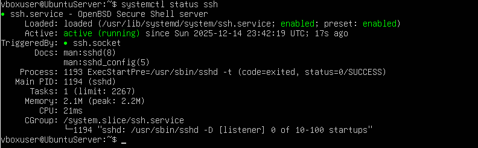
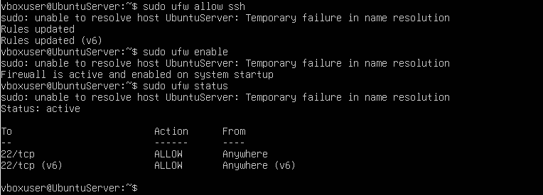
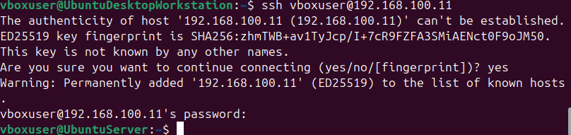
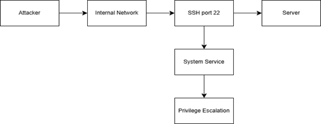
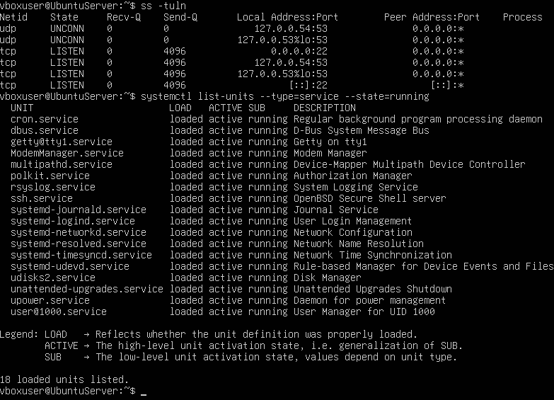

# Week 2 – Security And Testing Methodology:

## SSH Installation And Validation:

To install SSH I used these commands:
• sudo apt update  
• sudo apt install openssh-server -y  

I then took a screenshot of SSH running. SSH is very important as all the remaining server configurations will be performed remotely from the workstation.

**Figure 2.1 – SSH Service Running**  

---

## Firewall Configuration:

To enable UFW I used these commands:
• sudo ufw allow ssh  
• sudo ufw enable  
• sudo ufw status  

I then took a screenshot of the Firewall enabled with SSH allowed. This allows access to only important services.

**Figure 2.2 – UFW Firewall Enabled**  

---

## Remote SSH Login:

To allow SSH login from my server to the workstation I ran the command:
• ssh vboxuser@192.168.100.11  

(this was the IP address of my server.)

I then took a screenshot of the successful login. This proves that all the steps before were configured correctly.

**Figure 2.3 – Remote SSH Login**  

---

## Threat Model:

In this section, I created a threat model to identify significant risks. First I had to identify some of the potential threats these are written down below:
• SSH brute-force attacks  
• Weak authentication  
• Privilege escalation  
• Port scanning of open services  

This is the threat model diagram that I created.

**Figure 2.4 – Threat Model Diagram**  

---

## Attack Surface:

I ran these commands to know which ports are exposed by the server and also which services the server is running so I ran these commands.
• ss -tuln  
• systemctl list-units --type=service --state=running  

I then took a screenshot of this which shows what is the list of active services and what is the list of listening ports.

**Figure 2.5 – Active Services and Listening Ports**  

---

## Performance Testing Methodology:

| Subsystem | Tool | Purpose |
|---------|------|---------|
| CPU | stress-ng | Load behaviour |
| Memory | stress-ng | RAM |
| Disk | sysbench | Throughput and latency |
| Network | iperf3 | Bandwidth and latency |
| Web Server | apachebench | HTTP performance |

---

## Week 2 Reflection:

In week 2 I went from virtual machine setup to operating system analysis. By creating a threat model diagram and identifying potential risks. I now can see many weaknesses in my server. Also, analysing the attack surface showed me how attackers might attack. While the performance testing ensures that benchmarking will be accurate.
