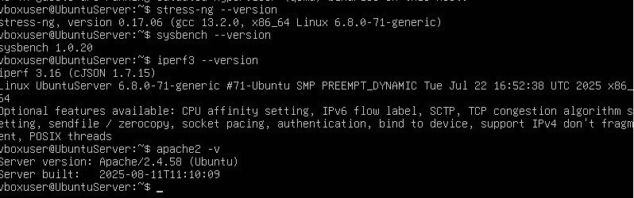
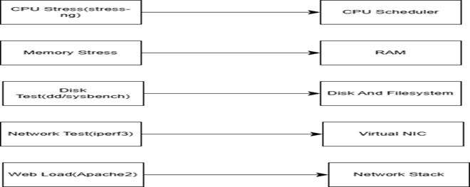
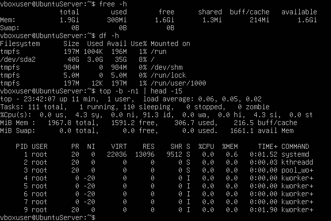

# Week 3 Application Selection and Resource Profiling:

## Benchmarking Tools Installation:

To install these benchmarking tools I ran these commands on the server.
• sudo apt install stress-ng sysbench iperf3 apache2 -y  

I then took a screenshot of the installation of these tools. These tools are important as they simulate controlled workloads. I verified installation by checking each tools version.

**Figure 3.1 – Benchmarking Tools Installation Verified**  

---

## Tools and Purposes:

| Application | Command | Subsystem Tested |
|------------|--------|------------------|
| stress-ng | stress-ng --cpu 2 | CPU load |
| stress-ng | stress-ng --vm 2 --vm-bytes 75% | RAM |
| dd | dd if=/dev/zero of=test bs=1m count=1024 | Write Throughput |
| sysbench | sysbench fileio run | I/O Performance |
| iperf3 | iperf3 -c 192.168.100.11 | Bandwidth |
| apache2 + ab | ab -n 1000 -c 10 localhost/ | Web Request load |

---

## Workload to Subsystem:

This diagram shows how each tool maps to a subsystem.

**Figure 3.2 – Workload to Subsystem Diagram**  

---

## Baseline Profiling:

To test baseline profiling before the load I ran these commands:
• free -h  
• df -h  
• top -b -n1 \| head -15  

I then took a screenshot of all the outputs then this allows comparison once the system comes under load.

**Figure 3.3 – Baseline Resource Profiling**  

---

## Week 3 Reflection:

In week 3 by selecting a wide range of benchmarking tools I made sure that every major subsystem CPU, memory, disk and network can be evaluated. Profiling this before allows me to understand how the server will perform under stress.
