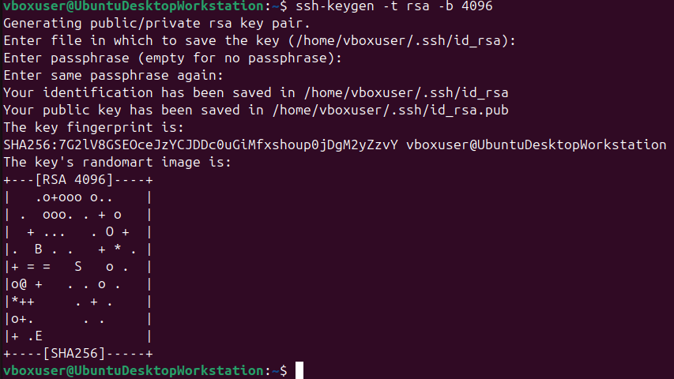
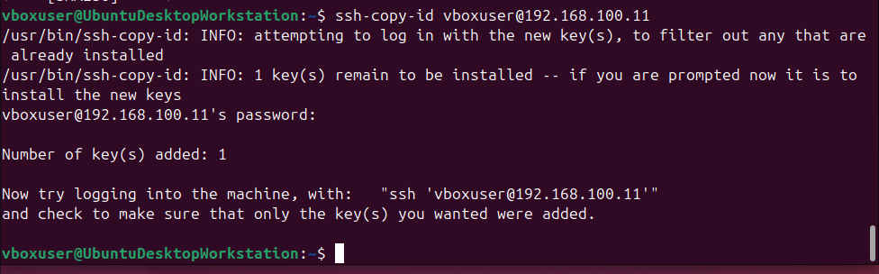
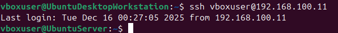
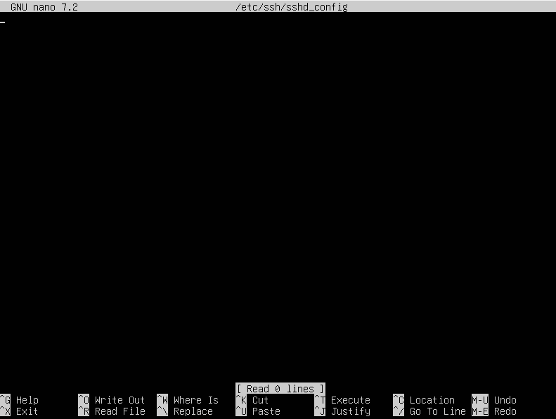
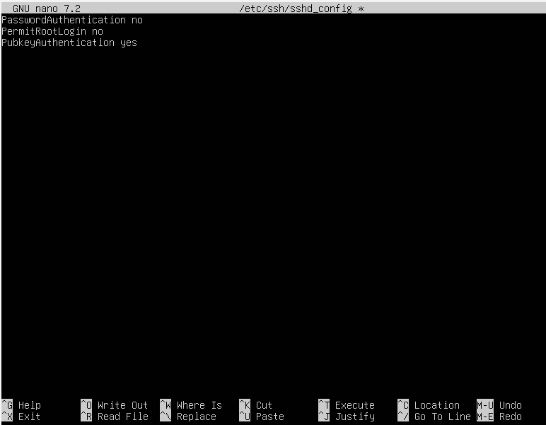
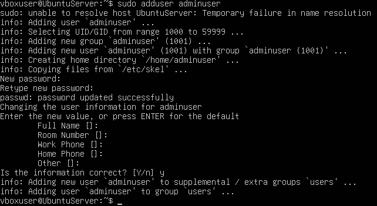
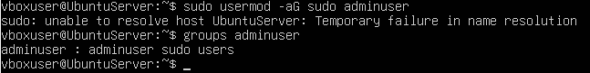
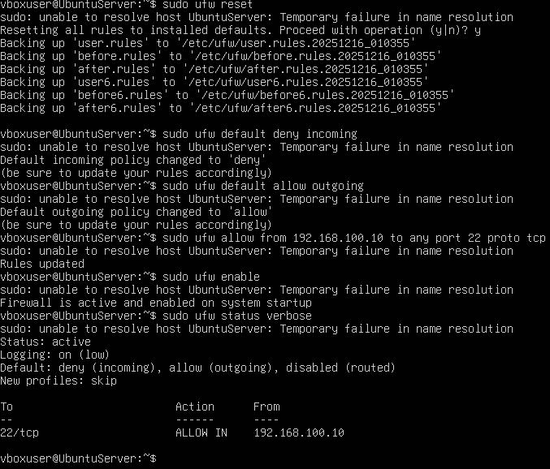
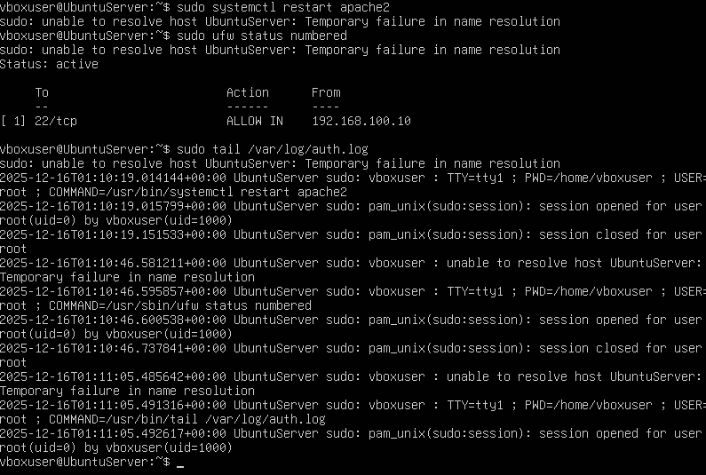
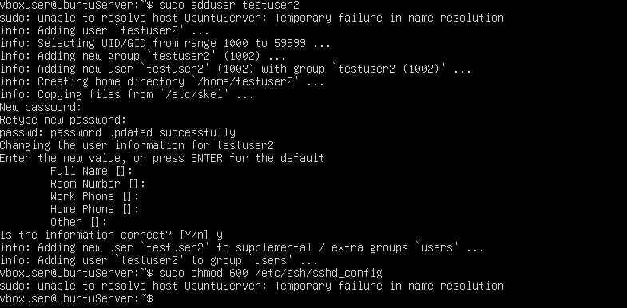

[⬅️ Week 3](week3.md) | [🏠 Home](index.md) | [➡️ Week 5](week5.md)

# **Week 4 – System Configuration and Security Implementation**

## **SSH Key-Based Authentication**

To improve the security of remote access to the server, SSH key based authentication was implemented. Password based SSH is vulnerable to brute force attacks therefore replacing provides stronger security.

To generate a SSH key on the workstation I did the following command:  
• ssh-keygen -t rsa -b 4096

Next I copied the public key from the workstation to the server using this command:  
• ssh-copy-id vboxuser@192.168.100.11

I was asked for the password of the server and then the terminal confirmed that the one key was added.

Then I had to verify that SSH key based authentication was working correctly so I logged into the server using this command:  
• ssh vboxuser@192.168.100.11

The login worked without asking for a password proving that key based authentication was active.

---

## **SSH Configuration Hardening**

After I confirmed that the SSH keys were working, I hardened SSH configuration by disabling password and root login.

I edited the SSH configuration file using this command:  
• sudo nano /etc/ssh/sshd_config

Before I made any changes the file was empty.

I then added these following lines to the file.  
• PasswordAuthentication no  
• PermitRootLogin no  
• PubkeyAuthentication yes  

After I saved the file I had to restart the SSH service to make sure the changes were applied.

---

## **User and Privilege Management**

To apply the principle of least privilege, I had to create a new non root administrative user. To create this I used this command:  
• sudo adduser adminuser

Then to grant administrative privileges I added the user to the sudo group using this command.  
• sudo usermod -aG sudo adminuser  

I then had to confirm if the user had privilges so I ran this command.  
• groups adminuser  

The output confirmed this.

---

## **Firewall Configuration**

To restrict network access to the server, I configured the Firewall. The aim was to allow SSH access only from the Workstation IP address of 192.168.100.10.

First, I had to reset any existing firewall rules with the command:  
• sudo ufw reset  

I then had to set the default firewall policies to  
• sudo ufw default deny incoming  
• sudo ufw default allow outgoing  

Then to allow SSH access only from the workstation I had to use this following command:  
• sudo ufw allow from 192.168.100.10 to any port 22 proto tcp  

After I configured all these rules I enabled the firewall with this command:  
• sudo ufw enable  

To verify the firewall configuration I checked the status of the firewall using:  
• sudo ufw status verbose  

The output confirmed that SSH access was allowed only from the workstation’s IP.

---

## **Remote Administration Evidence**

All the system administration tasks this week were performed remotely from the workstation via the SSH. To show this I executed multiple administrative command such as:  
• sudo systemctl restart apache2  
• sudo ufw status numbered  
• sudo tail /var/log/auth.log  
• sudo adduser testuser2  
• sudo chmod 600 /etc/ssh/sshd_config  

These commands demonstrate remote service management, firewall inspection, log monitoring, user management and permission.

---

## **Week 4 Reflection**

In week 4, I secured the server by implementing SSH key based authentication, hardening the SSH service, managing user privileges and configuring a firewall. This week helped establish a strong security foundation that prepares the system for later labs and weeks.

**References:**  
[3]

[⬅️ Week 3](week3.md) | [➡️ Week 5](week5.md)
