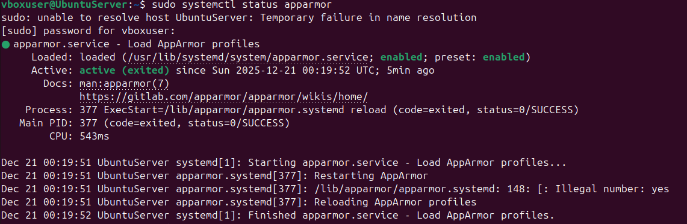
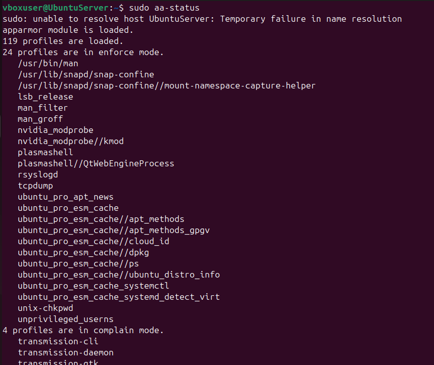
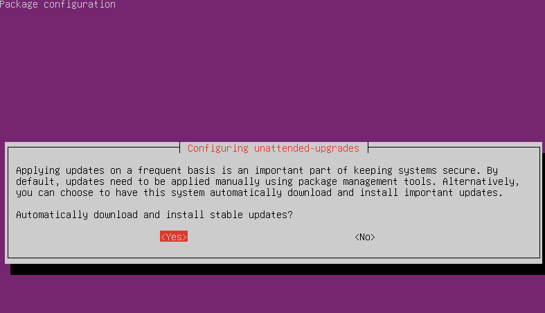
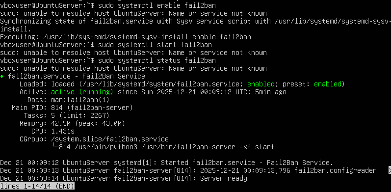
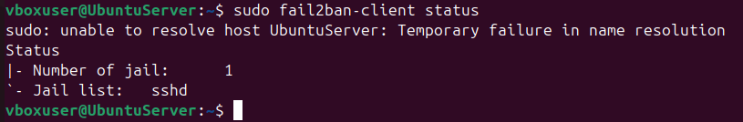
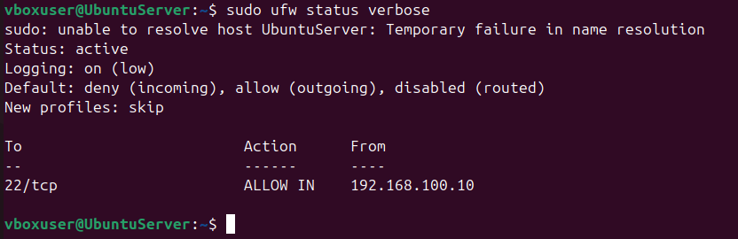

[⬅️ Week 4](week4.md) | [🏠 Home](index.md) | [➡️ Week 6](week6.md)

---

## **Week 5 – Advanced Security and Monitoring**

### **Access Control Implementation (AppArmor):**

To further strengthen system security, mandatory access control was implemented using AppArmor. AppArmor restricts how applications can use system resources.

To verify that AppArmor was enabled and running on the server, I used the following command remotely via SSH from the workstation:

• `sudo systemctl status apparmor`

The output confirmed and showed that the AppArmor service was enabled on the system.

To view and report on active AppArmor profiles I ran this command:

• `sudo aa-status`

This command displayed the number of loaded profiles, profiles in enforce mode and profiles in complain mode showing that AppArmor was enforcing access control policies.

---

### **Automatic Security Updates:**

To make sure that the server remains protected against newly discovered vulnerabilities, automatic security updates were enabled using the unattended upgrades package. This allows security patches to be applied automatically without any manual intervention.

To do this I ran the following command on the server via SSH:

• `sudo dpkg-reconfigure unattended-upgrades`

During the configuration process I selected **Yes** when prompted to automatically download and install updates.

Enabling automatic updates reduces the risk of unpatched vulnerabilities and improves the long-term security of the server.

---

### **Fail2Ban Installation and Verification:**

To protect the server from brute force attacks, Fail2Ban was installed and configured. Fail2Ban monitors authentication logs and automatically blocks IP addresses that generate repeated failed login attempts.

After installing Fail2Ban, I verified that it was running using this command:

• `sudo systemctl status fail2ban`

The output confirmed that Fail2Ban was active and running.

To confirm that Fail2Ban was actively protecting the SSH service, I ran this command:

• `sudo fail2ban-client status`

The output confirmed that one jail was active and that the **sshd** jail was enabled.

---

### **Firewall Verification:**

The firewall configuration that was completed in Week 4 was reviewed to ensure that security controls remained enforced. The firewall was checked to confirm that SSH access was restricted to the workstation IP address only.

To do this the following command was used:

• `sudo ufw status verbose`

The output confirmed that incoming SSH traffic was allowed only from the workstation IP address while all other incoming connections were denied.

---

### **Security Baseline Verification Script:**

To verify that all security configurations from Week 4 and Week 5 were applied correctly, a security baseline verification script was created and executed on the server. This script checked SSH hardening, firewall rules, Fail2Ban status, AppArmor enforcement and automatic security updates.

The script was created and edited on the server using:

• `nano security-baseline.sh`

The script includes clear line-by-line comments explaining each step.

After making the script executable, it was run using:

• `./security-baseline.sh`

The output confirmed that all security controls were correctly configured and active.

---

### **Remote Monitoring Script:**

To enable remote performance monitoring from the workstation, a monitoring script was created on the workstation. The script connects to the server via SSH and collects key performance metrics such as system uptime, memory usage, disk usage and CPU activity.

The script was created and edited on the workstation using:

• `nano monitor-server.sh`

The script includes clear line-by-line comments explaining each step.

The script was then executed from the workstation using:

• `./monitor-server.sh`

The output showed real-time metrics collected remotely from the server via SSH.

---

### **Week 5 Reflection:**

In Week 5, the server’s security and monitoring capabilities were enhanced beyond Week 4. Implementing AppArmor introduced mandatory access control, limiting what applications can access even if the system becomes compromised. Enabling automatic security updates ensures that the system remains protected against newly discovered vulnerabilities without manual intervention.

Fail2Ban provided automated protection against brute force attacks, while firewall verification confirmed that network access restrictions were still being correctly enforced. Creating a security baseline verification script allows all security controls to be checked quickly and reliably. The remote monitoring script demonstrates real-world administrative practices by collecting system performance metrics over SSH.

Week 5 strengthened the server’s resilience, improved visibility into system behaviour and prepared the system for performance evaluation and security auditing in the following weeks.

---

[⬅️ Week 4](week4.md) | [➡️ Week 6](week6.md)
