[⬅️ Week 5](week5.md) | [🏠 Home](index.md) | [➡️ Week 7](week7.md)

---

## **Week 6 – Performance Evaluation and Analysis**

### **Baseline Performance Testing:**

Before applying any workload, baseline system performance was measured to have a reference point for comparison.

The following commands were executed on the server via SSH:

• `free -h`  
• `df -h`  
• `top -b -n1 | head -15`

These commands provided information about memory usage, disk usage, CPU idle time and load averages. At baseline, the server showed low CPU utilisation, approximately 330MB of memory used and minimal disk utilisation.

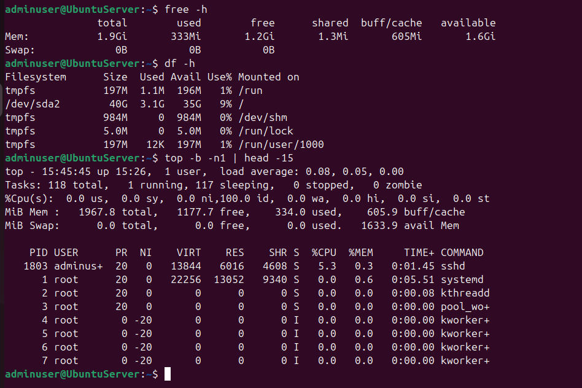

---

### **CPU Performance Testing**

#### **CPU Load Testing:**

To test CPU behaviour under load, a CPU stress test was executed using stress-ng.

The following command was run on the server via SSH:

• `stress-ng --cpu 2 --timeout 60s`

While the stress test was running, CPU utilisation was monitored using:

• `top -b -n1 | head -15`

During the test, two CPU processes consumed nearly all available CPU resources, with CPU usage reaching 100%. This confirmed that the CPU was fully saturated under load.

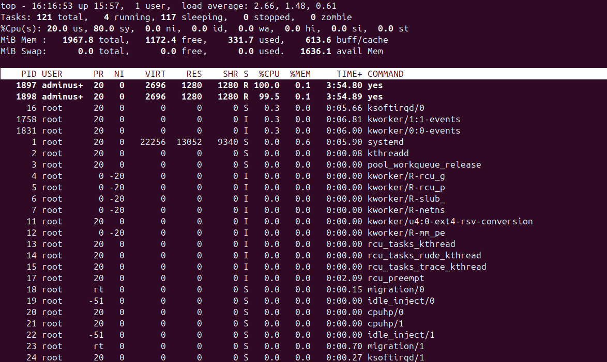

#### **CPU Bottleneck Analysis:**

The high CPU utilisation confirms that CPU availability becomes a bottleneck under intensive workloads. Once the stress process had ended, CPU usage returned to idle levels, showing stable recovery.

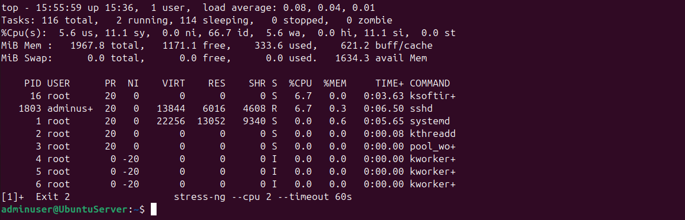

---

### **Memory Performance Testing:**

To evaluate memory behaviour under load, a virtual memory stress test was performed.

The following command was run on the server via SSH:

• `stress-ng --vm 1 --vm-bytes 75% --timeout 120s`

During the test, memory usage increased significantly with available memory dropping to approximately 135MB, showing that the workload consumed the majority of the system’s RAM.

Memory usage was monitored using:

• `free -h`

This demonstrates how Linux manages memory pressure using buffers and cache without causing system instability.

---

### **Disk I/O Performance Testing:**

Disk input/output performance was tested using sysbench.

The following command was executed on the server via SSH:

• `sysbench fileio run`

The results provided performance metrics including:

• Read throughput: 3.07 MiB/s  
• Write throughput: 2.04 MiB/s  
• Average latency: 1.33 ms  
• Maximum latency: 46 ms  

These values show moderate disk performance suitable for typical server workloads.

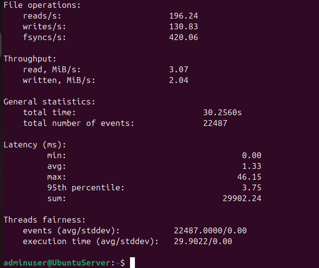

---

### **Network Performance Testing**

#### **Network Throughput and Latency:**

Network performance was evaluated using iperf3.

On the server, the following command was executed:

• `iperf3 -s`

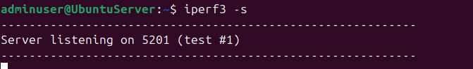

On the workstation, the test was initiated using:

• `iperf3 -c 192.168.100.11`

The results showed an average throughput of approximately 1.07 Gbit/s, confirming strong network performance within the internal network.

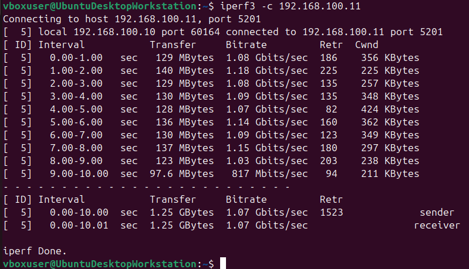

---

### **Service Response Time Testing (Web Server):**

To evaluate service response times, ApacheBench was used to test the Apache web server.

The following command was executed on the workstation:

• `ab -n 1000 -c 10 http://192.168.100.11/`

Key results included:

• 623.89 requests per second  
• Mean request time of 16.03 ms  
• 0 failed requests  
• Maximum response time of 145 ms  

These results show that the web server handles requests efficiently under moderate load.

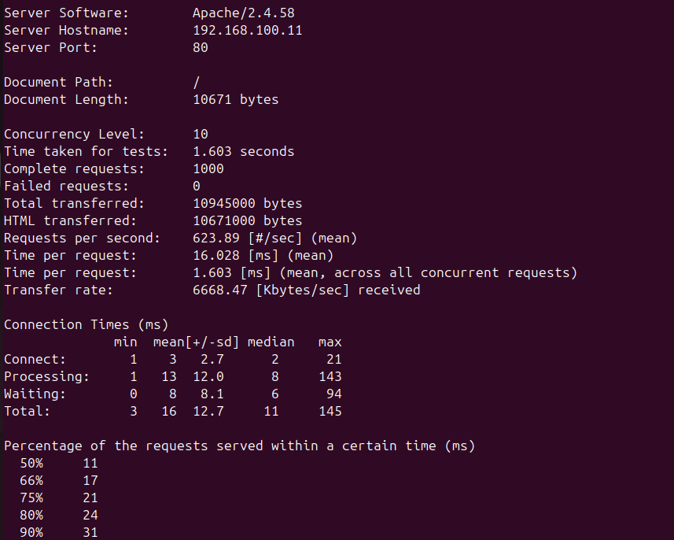

---

### **Optimisation Testing and Analysis**

#### **1. Firewall Rule Restoration:**

After network testing, temporary firewall rules allowing performance tools were removed to restore a minimal attack surface.

Firewall rules were verified using:

• `sudo ufw status`

This ensured that only SSH access from the workstation was allowed.

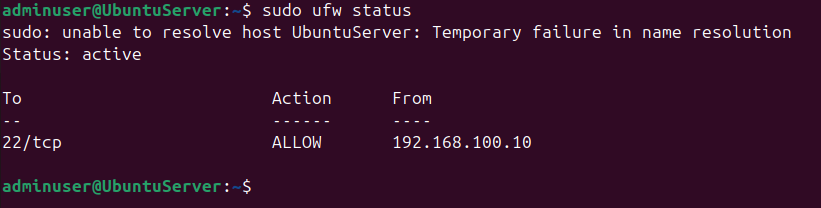

#### **2. Load Recovery Behaviour:**

After CPU and memory stress tests were completed, system resources returned to baseline levels without manual intervention. This demonstrates effective Linux resource scheduling and memory management, with CPU returning to idle and memory buffers being reclaimed.

---

### **Performance Data Summary**

| Subsystem | Tool        | Result |
|---------|-------------|--------|
| CPU | stress-ng | 100% utilisation under load |
| Memory | stress-ng | Available memory reduced to ~135MB |
| Disk I/O | sysbench | Average latency 1.33 ms |
| Network | iperf3 | Throughput ~1.07 Gbit/s |
| Web Service | ApacheBench | ~624 requests/sec |

---

### **Performance Visualisation and Analysis**

#### **CPU Usage Comparison:**

A bar chart was created to compare CPU usage during baseline and stress testing.

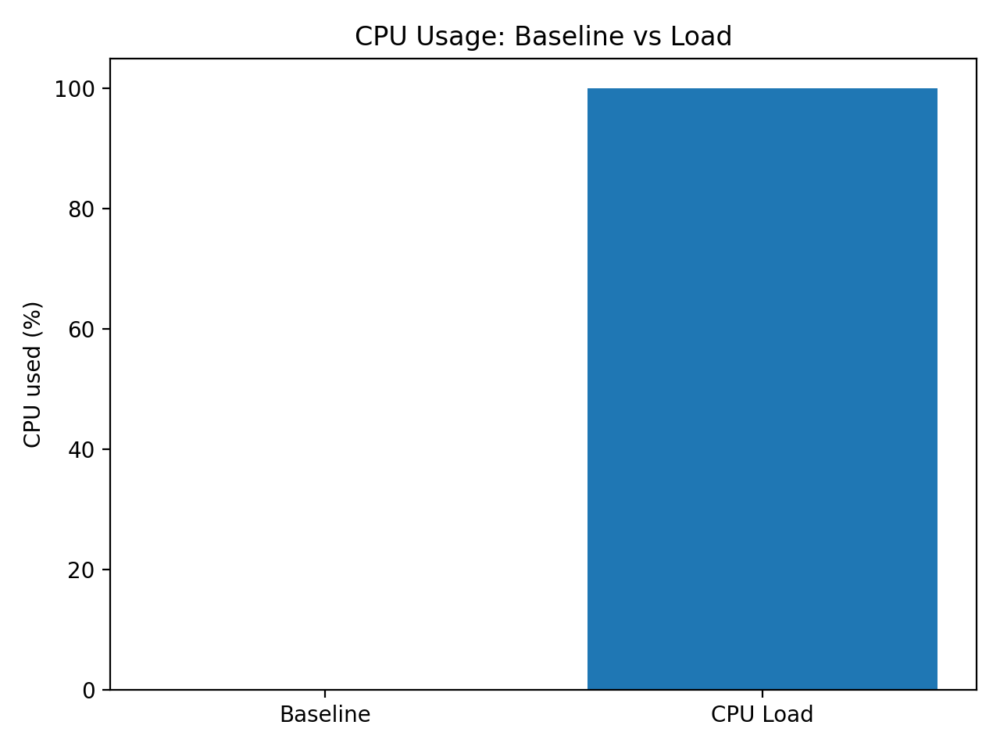

This chart shows a significant increase in CPU utilisation when stress was applied, confirming CPU saturation under load.

#### **Memory Usage Comparison:**

A second bar chart was created to compare memory usage before and after stress testing.

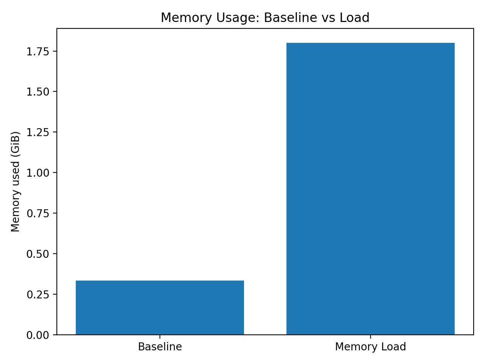

This chart shows increased memory consumption during the stress test, confirming that the memory subsystem was heavily utilised.

#### **Network Throughput Analysis:**

A line graph was created to visualise network throughput over time using iperf3 results.

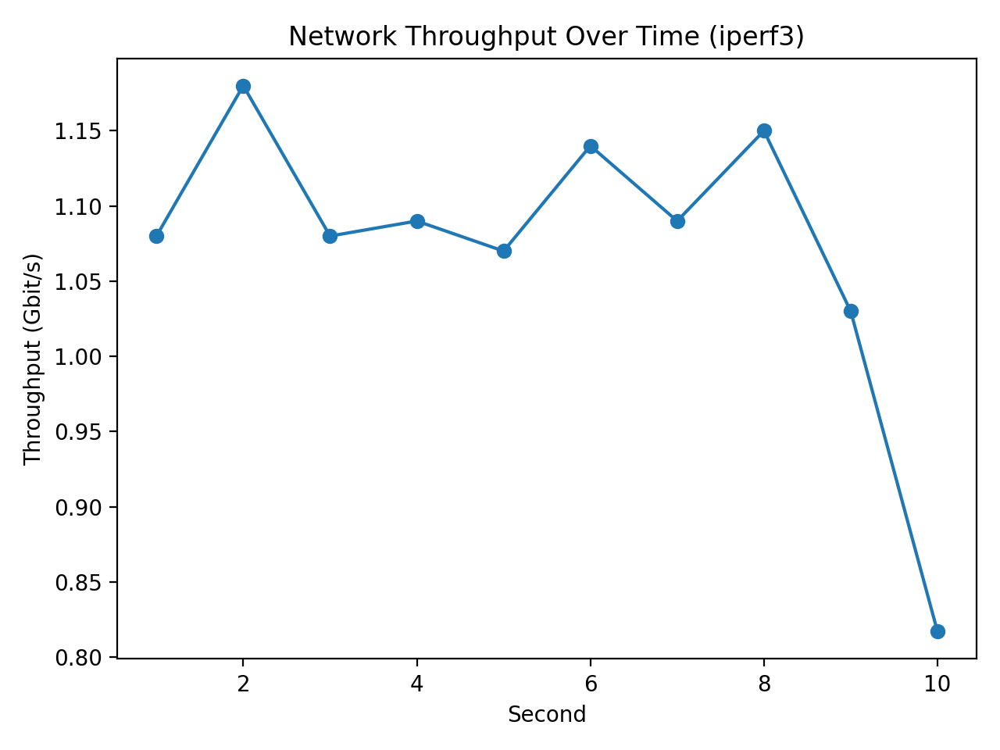

The graph shows stable high throughput throughout the test, indicating good network performance.

#### **Web Server Response Time Analysis:**

A response time graph was created using ApacheBench results to visualise web server performance.

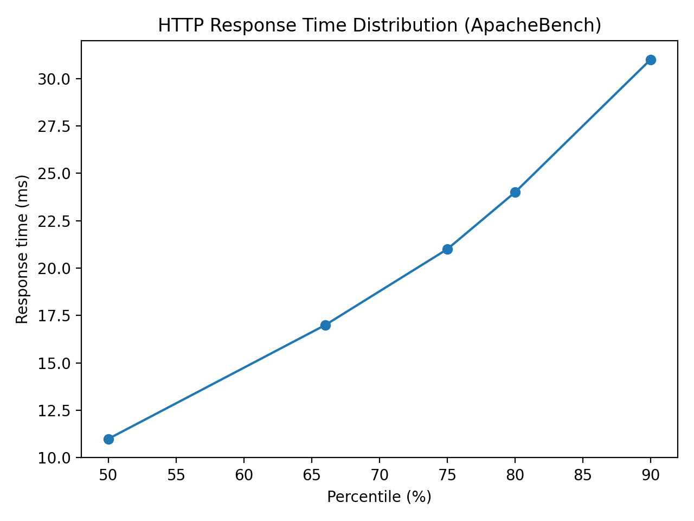

The graph shows that most HTTP requests completed with low response times even under load, demonstrating good web server responsiveness.

---

### **Week 6 Reflection**

Week 6 provided valuable insight into how the operating system behaves under different workload conditions. CPU and memory stress tests highlighted potential bottlenecks, while disk and network tests showed stable and consistent performance. The Apache web server handled concurrent requests efficiently.

Optimisation testing confirmed that Linux can recover effectively after periods of high load. Restoring firewall rules ensured that the system returned to a secure configuration after testing. Overall, this week prepared the system well for the final security audit and hardening evaluation in Week 7.

---

[⬅️ Week 5](week5.md) | [➡️ Week 7](week7.md)
